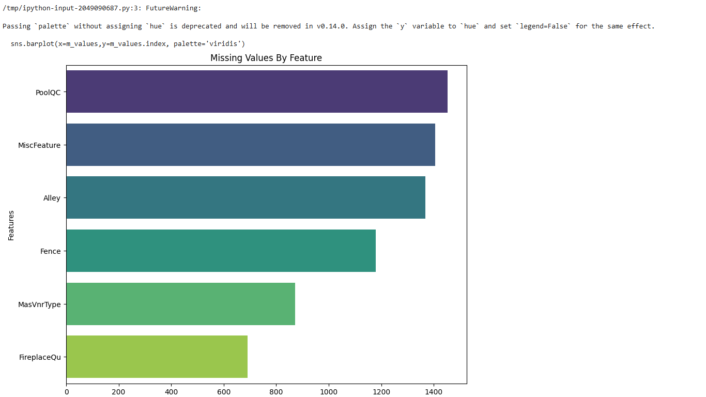
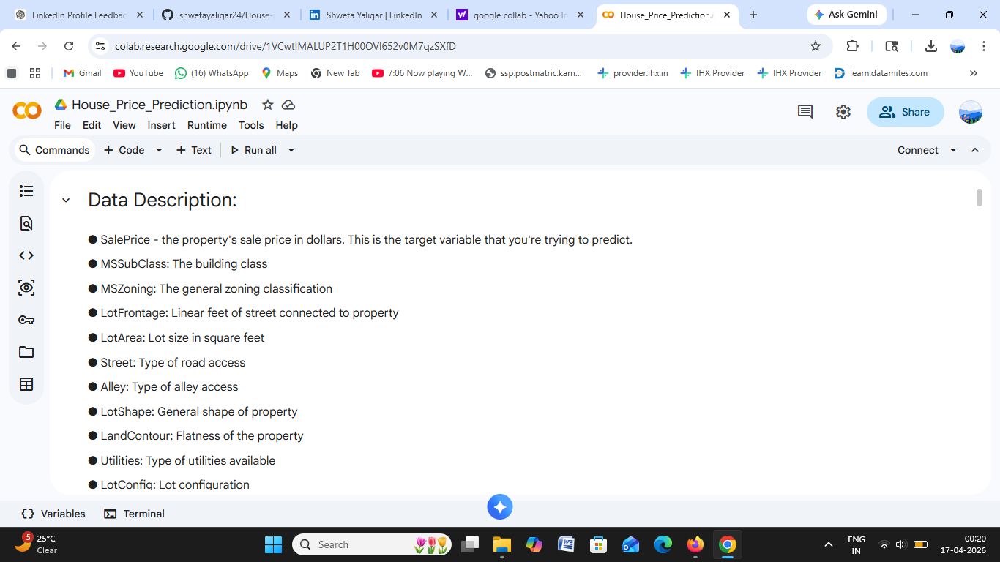
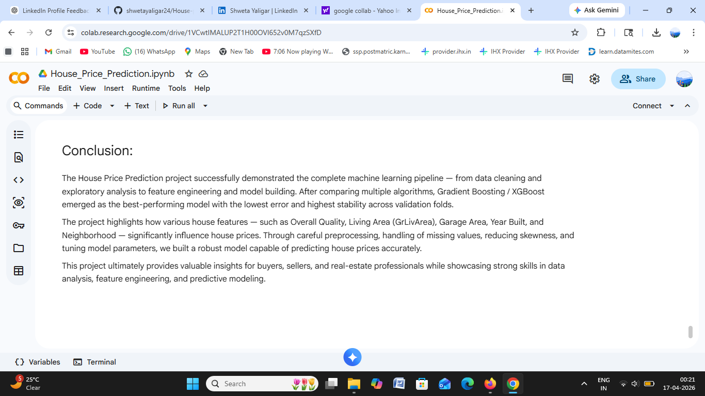

# House-price-prediction
Developed an advanced machine learning model to predict house prices using location, size, and structural features.

Performed end-to-end data preprocessing including handling missing values, outlier detection, and skewness reduction to improve data quality. Conducted exploratory data analysis (EDA) to understand key relationships between features and price.

Implemented feature engineering techniques to enhance model performance and applied multiple regression algorithms. Optimized the final model using XGBoost, achieving an R² score of 0.89.

The project identified important factors influencing house prices such as location, area, and number of rooms, providing valuable insights for real estate pricing and decision-making.

---

## 🚀 Problem Statement
Predict house prices using features like location, size, number of rooms, and other structural details.

---

## 🛠️ Technologies Used
- Python  
- Pandas, NumPy  
- Scikit-learn  
- XGBoost  

---

## 📊 Project Workflow
- Data Cleaning & Preprocessing  
- Handling Missing Values  
- Outlier Detection  
- Feature Engineering  
- Model Training & Evaluation  

---

## 🤖 Models Used
- Linear Regression  
- Random Forest  
- XGBoost  

---

## 📈 Results
- Achieved **R² score of 0.89** using XGBoost  

---

## 🔍 Key Insights
- Location is a major factor affecting price  
- Property size and number of rooms influence pricing  
- Feature engineering improved model accuracy  

---

## 📊 Project Visuals

### Missing Values Analysis

### Dataset Overview

### Conclusion

---

## 📌 Conclusion
The House Price Prediction project successfully demonstrates an end-to-end machine learning pipeline, from data preprocessing and exploratory analysis to feature engineering and model development.

After evaluating multiple regression models, XGBoost delivered the best performance with an R² score of 0.89, providing accurate and stable predictions. Key features such as overall quality, living area, and location were found to have a significant impact on house prices.

This project highlights the importance of data cleaning, handling missing values, and feature engineering in improving model performance. The developed model can support real estate decision-making by providing reliable price estimations.
